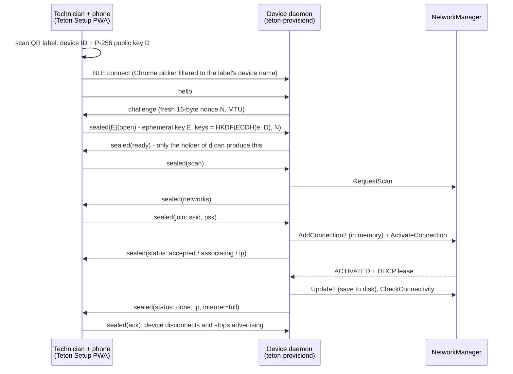

# Architecture

A technician scans the QR label on a device with an Android phone. The phone and the
device set up an encrypted session over Bluetooth Low Energy. The phone sends the Wi-Fi
credentials, and the device joins the network through NetworkManager, reporting each step
back to the phone. No internet, cloud or shared network is involved at any point.

The full protocol is in [SPEC.md](../SPEC.md) §4–§6. Evidence from a real run is in
[docs/evidence](evidence/README.md).

## 1. Why BLE, and what it costs

| Option | Why not (or why) |
|---|---|
| **BLE GATT (chosen)** | The Wi-Fi radio stays free while the phone is connected, so the device can try the network and **report the result on the same link**: "Wrong password", "network not found", "no DHCP" or "online". This feedback loop matters most for a non-developer. It is also the established pattern (Matter commissioning, ESP-IDF provisioning, HomeKit), and its short range means the technician has to be physically near the device. |
| SoftAP + web page | Works in any phone browser with nothing installed. But most single-radio chips can't reliably host a hotspot and join another network at once, so the phone loses its link **exactly when the join result arrives**. Phones also tend to leave hotspots without internet. In a hospital, 200 temporary hotspots would also look like rogue APs to the IT team's wireless intrusion detection. |
| Wi-Fi Easy Connect (DPP) | Standards-based and bootstrapped from a QR code, the most elegant on paper. NetworkManager doesn't expose it, driver support is uneven, and Android's built-in configurator can only share the phone's current network. Too much hardware risk. |
| QR shown to the device's camera | No radio at all, but information only flows one way, so there's no feedback. A Wi-Fi QR is plaintext unless encrypted to the device's key, and it sidesteps rather than meets the "over the air" constraint. |
| USB / NFC / acoustic | Cables and NFC readers aren't on the device; acoustic is fragile in a hallway. |

**Trade-offs we accepted:**
- **iOS:** Safari has no Web Bluetooth, so the configurator is Chrome-only (Android, desktop Chrome). A production deployment would ship a native app through MDM (see §6).
- **BLE stack quirks:** two of the three bugs found on hardware were BLE platform issues (§5).
- **One phone per device at a time:** fine at the scale of one technician per device.

Prior art worth naming: the open *Improv Wi-Fi* BLE protocol sends credentials **in
plaintext**, which is exactly what constraint 3 rules out. Matter is the closest model: BLE,
a QR setup code and a key exchange derived from it.

## 2. How credentials are protected in transit

### Threat model

Anyone within BLE range (tens of metres) can **listen** to the link, **impersonate** a
device by advertising the same name, **replay** recorded traffic, or **connect** to a device
and send it anything. Holding the physical label is what authorizes provisioning, as with
Matter's setup code.

### Mechanism

| Step | What it does |
|---|---|
| **Label** | Each device has a long-term P-256 key pair. The QR holds `https://…/#v=1&id=<id>&pk=<public key>`, and `id = SHA-256(pk)[0..6]`, so a misprinted label is rejected. The data sits after the `#`, so it never reaches a server. |
| **Fresh nonce** | The device sends a new 16-byte nonce `N` for every connection. |
| **Key agreement** | The phone makes a one-time key pair `e/E`. `Z = ECDH(e, D)`, then `HKDF-SHA256(Z, salt=N, info="teton-prov v1" ‖ id ‖ E ‖ D)` yields two 32-byte keys, one per direction. |
| **Sealing** | AES-256-GCM, nonce = per-direction counter. The receiver accepts only the next counter value. |
| **Device authentication** | Only the holder of the device's private key `d` can derive the keys. The phone treats the first message that decrypts (`ready`) as proof and shows *Device verified* before asking for a password. |

| Attack | Result |
|---|---|
| Passive eavesdropper | Sees `hello`, `challenge` (a nonce) and ciphertext. **Shown on a real capture**: 2 plaintext envelopes, 22 sealed, none of the four passwords present in any encoding ([evidence](evidence/README.md#constraint-3-no-plaintext-credentials-over-the-air)). |
| Impostor device | Can't derive the keys, so it can't read the password and **can't fake "Device verified" or "Device online"**. |
| Replay / reorder / reflection | Per-connection nonce, strict counters and per-direction keys. All covered by loopback tests. |
| Someone without the label connecting | Every message fails to decrypt. After 3 failures the session ends, and the device then refuses new sessions for 5 s, doubling up to 5 min. |
| Wrong passwords, repeated | **Device-wide** lockout after 3 failed authentications: 30 s, 60 s, then 120 s. Reconnecting doesn't reset it. It exists to pace a fumbling technician and to keep the hospital network's own defenses from tripping, not to protect the cryptography. |

### Choices and why

- **No BLE pairing.** "Just Works" pairing doesn't protect against an impostor in the middle. Passkey pairing with a fixed printed passkey is known to be breakable. Web Bluetooth gives the page no control over pairing, and the system pairing pop-ups would confuse technicians. Application-layer crypto is also visible and testable.
- **No PAKE.** A password-based key exchange (SPAKE2+, SRP) is only needed when the shared secret must be short enough to type. The QR carries a full public key. If labels ever had to be typeable, a PAKE would be the next step.
- **P-256 rather than X25519.** Native in every browser's WebCrypto, so the configurator has **zero crypto dependencies**. It's FIPS-approved, and supported by TPM 2.0 and secure elements, so the device key can move into hardware without changing the protocol.
- **`aws-lc-rs` on the device.** `ring` deliberately refuses ECDH with a long-term key, and RustCrypto's `p256` has never been independently audited. AWS-LC has FIPS 140-3 validation.
- **Same bytes in both implementations.** `tests/test-vectors.json` is generated from Rust and reproduced byte for byte by the JS (WebCrypto) tests, including a full transcript replay of the JS session client.

### At rest and in memory

- The device key is stored with mode `0600`, owned by the service user.
- NetworkManager saves the Wi-Fi password in a root-only system profile. On Ubuntu 24.04 that's `/etc/netplan/90-NM-<uuid>.yaml`, mode 0600, which we discovered during M2. Encrypting it at rest (disk encryption, or sealing the key in a TPM) is out of scope.
- The password is held in a `Secret` type that is wiped on drop, and its `Debug` output prints `<redacted len=N>`. The logs contain no secrets; the evidence run's logs confirm this.
- The phone keeps the network for "next device" **in memory only**. Its "Done today" list stores device ID, time, SSID, result and room, but never a password.

## 3. Device design

**States.**
- **Unprovisioned:** advertises.
- **Provisioned:** quiet, no advertising (§6 explains why this would change at scale).
- **Recovery:** offline for more than 10 minutes, for example after the hospital changed its Wi-Fi password. It advertises while NetworkManager keeps retrying the old network.
- **Manual window:** `teton-device reprovision`, standing in for a hardware button.
- One session at a time. Advertising pauses during a session, and a second phone that writes is disconnected.

**Joining without breaking anything.**
1. The new profile is created **in memory**, under a separate name.
2. It's saved to disk only after the device has an IPv4 lease.
3. On failure it's deleted and the previous profile is restored. A failed profile never keeps retrying in the background, where repeated logins could lock accounts or trigger alerts.

The join outcome comes from NetworkManager's state and failure codes:

| Failure code | Reported as | Counts toward lockout |
|---|---|---|
| `SUPPLICANT_DISCONNECT` | wrong password | yes |
| `SSID_NOT_FOUND` | network not found | no |
| `DHCP_*` | no address (contact IT, DHCP) | no |
| no result within 30 s | timeout | yes |

Afterwards, NetworkManager's connectivity check separates "online" from "on Wi-Fi but no internet: contact IT". In production that check would be a TLS check against Smith.

**Least privilege.** The daemon parses data from anyone in radio range, so:
- It runs as the system user `teton-prov`, with no capabilities, a read-only filesystem and Unix sockets only.
- It runs in a **private network namespace: its only interface is `lo`**. NetworkManager does the networking for it.
- A polkit rule grants it exactly three NetworkManager actions.
- `systemd-analyze security` rates it **0.4 SAFE**.

In the evidence run, NetworkManager's audit log shows every profile change made by `uid=133` (`teton-prov`).

**Language.** The daemon is Rust: memory-safe parsing of radio input, real zeroization of secrets, and a single binary that cross-compiles to ARM. That's the same choice a production device would make.

## 4. Configurator design

The configurator is a PWA on GitHub Pages: plain JS, **no dependencies**, a strict Content-Security-Policy, and a service worker for offline use. The technician installs it once while online and uses it offline on site.
- It opens from the label URL (phone camera app) or from the in-app scanner (`BarcodeDetector`).
- Every string that comes from a device or network (SSIDs, IDs) is shown with `textContent`. A nearby attacker can name a Wi-Fi network anything, including HTML.
- The CSV export guards against spreadsheet formula injection.

Each failure shows a plain sentence plus a short code for support (`E-AUTH`, `E-DHCP`, `E-NOT-FOUND`, …). The lockout shows a live countdown, and the phone receives it as soon as it connects, before the technician types anything.

## 5. What the hardware taught us

Three bugs only showed up on real hardware. Each one is fixed and, where a test can catch it, covered by one:

1. **BlueZ 5.72 (Ubuntu 24.04 release build) can't advertise on current noble kernels.** `bluetoothd` sends an oversized *Add Ext Adv Data* management command, which the kernel rejects (LP: #2164626). The `btmon` trace showed it; the fix is `bluez 5.72-0ubuntu5.6`. The package now depends on that version, so a reviewer gets a clear dependency error instead of a silent failure.
2. **Notifications over 512 bytes are silently truncated.** Chrome negotiated MTU 517, and the device sent `MTU − 3 = 514`-byte chunks. ATT caps attribute values at 512, so a 20-network scan reply arrived 2 bytes short per chunk and failed AES-GCM, which correctly refused it. Chunks are now `min(MTU − 3, 512)`. The test radio rejects anything larger, and a test that scans a crowded simulated environment fails on the old code.
3. **NetworkManager passes through `NEED_AUTH` on every activation** (reason 0) while it loads stored secrets. Our first rule ("`NEED_AUTH` after `CONFIG` = wrong password") cancelled every join before the handshake. A wrong password actually shows as `NEED_AUTH` with reason 8. The recorded state sequences are now regression tests. Cancelling at that point also means GNOME never gets to show a password dialog.

## 6. Provisioning 200 devices in a hospital wing

Some of this is already built in:
- The QR identifies one exact device, so Chrome's picker shows exactly one entry even with 199 others nearby.
- The device-wide lockout, plain-language errors and recovery mode all apply.
- "Use 'roy' again" reuses the network for the next device without retyping.
- "Done today" records device, time, network, result and room, and exports CSV.

What would change:

1. **Technicians shouldn't type, or even know, the hospital Wi-Fi password.** Smith already knows every device's public key from the factory. It can encrypt the network settings separately for each device **ahead of time**, and the app carries those sealed blobs without being able to read them, so a lost phone leaks nothing. The cost: a blob prepared in advance can't include the per-connection nonce, so replay protection moves to an expiry time and counter signed by Smith. The live session encryption still wraps the blob.
2. **One credential per device, not one shared by all 200.** Ideally **EAP-TLS with a certificate per device issued through Smith**, or per-device passwords (Cisco iPSK, Aruba MPSK). One device can then be revoked without changing the password on 199 others. Add an IoT VLAN, MAC registration and a firewall rule that allows only Smith.
3. **The deployment record is what facilities actually needs:** device → room. The app records the room for each device and syncs the list to Smith when it's back online. On first contact, each device authenticates to Smith with its key, and Smith checks it against the expected shipment and flags strays.
4. **Scanning any label should tell the technician in seconds whether the device is already set up.** Today a provisioned device stops advertising, so scanning its label makes Chrome's device list search for about a minute (a fixed Chrome scan the page can't shorten) before *Device not found*. Walking a ward of 200 devices, technicians would hit that constantly. Instead, provisioned devices would keep advertising slowly (every 1–2 s) and answer `hello` with a plaintext "already provisioned" reply, so within a couple of seconds the app shows *"This device is already set up. To change its network, press its setup button."* No key exchange or join happens until the setup window is opened, and the reply reveals only "already set up", not the network or whether it's online. The cost is that the device stays reachable over BLE, but the only thing exposed is parsing one `hello`. Staying silent buys little anyway: the app filters Chrome's picker by the label's exact device name, so finished devices never clutter it.
5. **A preloaded list of the site's devices** lets the app reject devices from the wrong shipment, and covers damaged labels: type the serial, and the app looks up the public key.
6. **Changing the Wi-Fi password without a site visit.** Smith sends the new settings to every online device *before* IT switches over, and devices keep the old settings as a fallback. Recovery mode becomes a rare safety net, not the normal way to handle a password change.
7. **Distribution.** A native app on MDM-managed phones: works on iPhones, and allows managed updates and certificate pinning to Smith.
8. **Remove the hallway step where possible.** Pre-configure devices at the warehouse with the site's settings, so on site the job is "mount and plug in". The BLE flow stays as the repair and exception tool. The best scalable provisioning flow is the one 95 % of devices never need.
9. **Radio and concurrency.** Several technicians can work in parallel; the one-session-per-device rule prevents collisions. 200 BLE advertisers are well within BLE's capacity, but a device that has waited a long time should advertise less often. Hospital IT and clinical engineering would need to approve BLE use.

## 7. Limitations and next steps

- **WPA2/WPA3-Enterprise isn't implemented**, though most hospitals use it. I couldn't test it, and I didn't want to ship untested code. The message format has a `security` field and a version number for it (see §6.2).
- A provisioned device is silent over BLE. Scanning its label makes Chrome's device list search for about a minute before *Device not found*, unless the technician closes it sooner (the app tells them to after about 15 s). §6 point 4 describes the fix.
- The join lockout lives in memory. Rebooting the device to clear it takes about as long as the lockout itself, so this was deliberate.
- SSIDs that aren't valid UTF-8 are displayed lossily.
- Next: `cargo-fuzz` on the chunk reassembler and message parser (currently covered by proptest), the device key in a TPM, and a Smith reachability check instead of NetworkManager's generic one.

## Testing

| Layer | What |
|---|---|
| Protocol (Rust, 24 tests) | Shared test vectors; proptest round-trips and hostile input for the reassembler; replay, reorder, reflection and impostor cases; label validation |
| Configurator (Node, 19 tests) | The same vectors through WebCrypto; full session transcript replay; framing; labels; CSV escaping |
| Device (Rust, 26 tests) | 12 **loopback** scenarios: a test phone drives the real device and session code over an in-memory radio with simulated Wi-Fi and a paused clock (lockout across reconnects, impostor, replay, timeouts, recovery, manual window, ATT size limit, …); NetworkManager state-sequence replays; validation and classification |
| Hardware (M2–M8) | Real NetworkManager joins and failures, nRF Connect and Chrome on Android, reboot persistence, recovery via phone hotspot, the installed hardened service, and the evidence run with a `btmon` capture |

CI runs formatting, clippy, all tests and a test-vector freshness check on every push.
